## 交互雪制作

### 1.画板制作

##### 1.1.本节效果

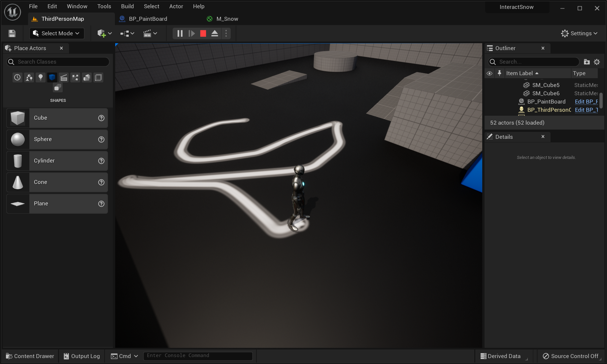

##### 1.2.大蓝图BP_Paintboard

在每帧获取人物位置转换到这一个 rt 的 uv 上，使用蓝图在这个位置绘制一个texture。新建一张RT（1024*1024的RT，RGBA16F）上绘制Texture，与人物中心重合，注意角度。

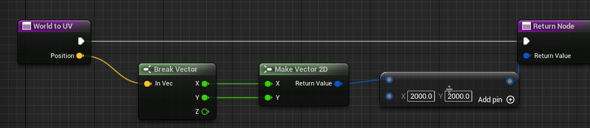

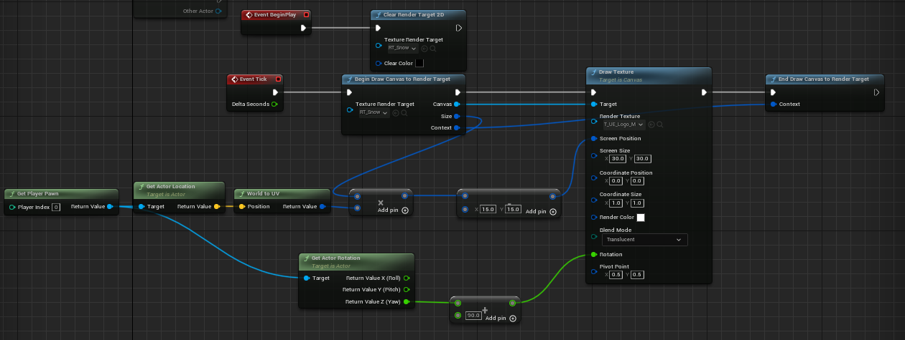

##### 1.3.材质M_Snow

将RT覆盖在2000*2000地板上，通过UVlerp和boxmask

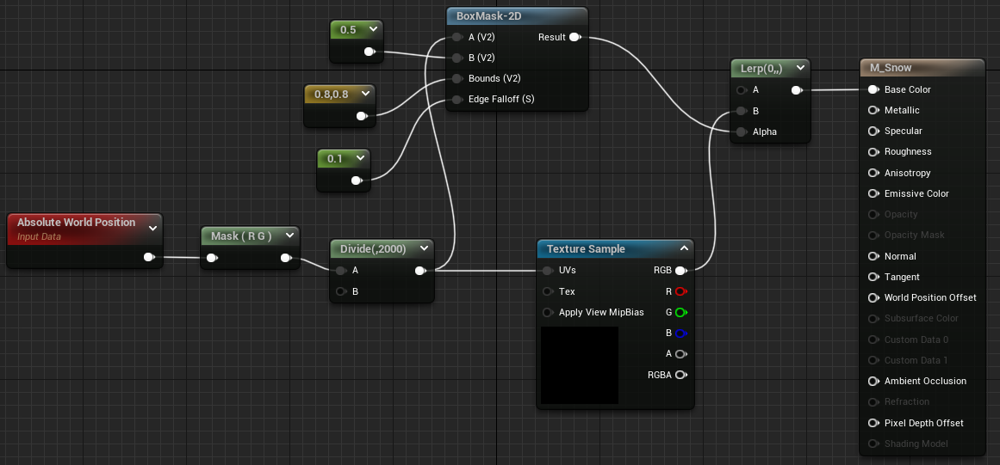

##### 1.4.QA

A. 纹理不在人物正中心？需要减去Size的一半。

B.为什么要后面绘制的东西不见了？多个脚印重叠问题：换成半透明图片，BlendMode选半透明。

C.画板到后期我们肯定是雪是要越踩越低的？所以我们到后面还得获取到雪原本它的一个高度，肯定不能有简单的透明。我们肯定还要拿材质，就用 mean 取最小值的方法。

### 2.映射位置

##### 2.1.本节效果

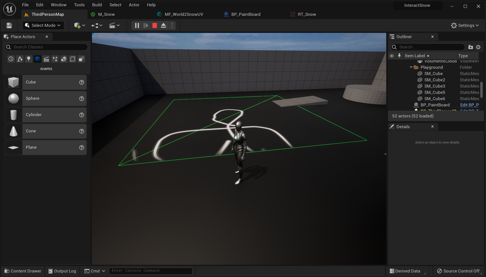

##### 2.2.材质函数MF_World2SnowUV

将大蓝图中地形的Position和size，传入Materials；有两种方法，一个是**动态材质实例**（在蓝图里 create dynamic material instance，需要拿到地面引用，把动态材质实例给地面 set material，个体控制），另外一个方法就是使用**材质参数集**（material parameter collection，全局控制）。

A.首先设置MPC_Snow矩阵，用来存Position和Size

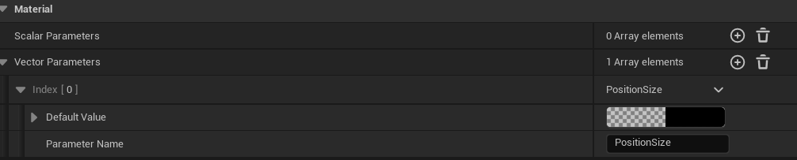

B.新建材质函数并应用在M_Snow中

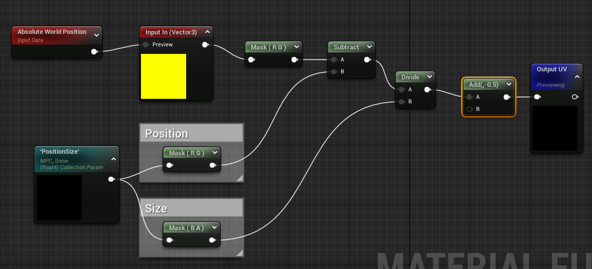

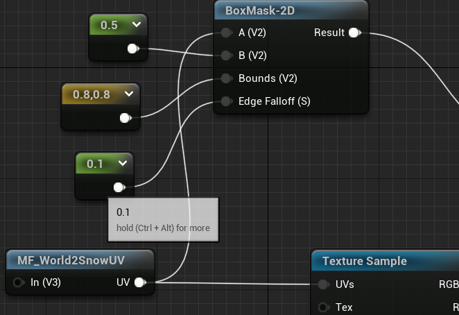

C.蓝图中添加全局变量材质参数

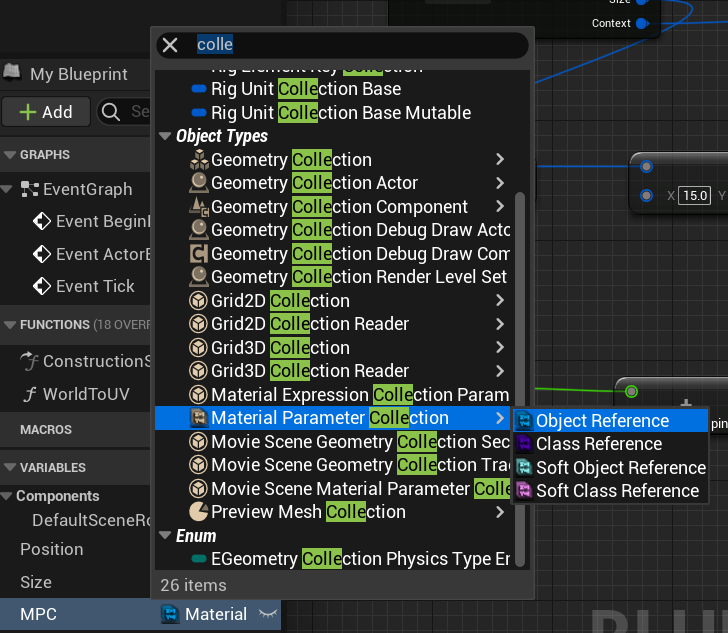

##### 2.3.BP_Paintboard：Set MPC和更新World2UV

现在就可以不受上一节2000*2000的限制，直接在蓝图变量下设置位置大小，记得映射转换成UV

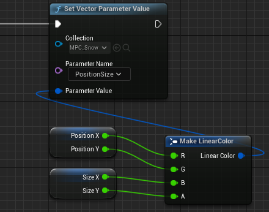

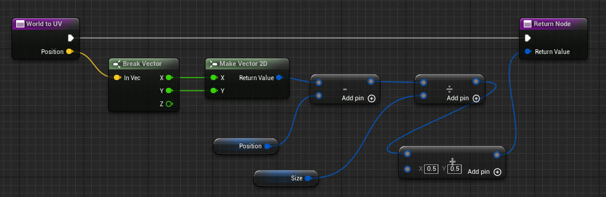

##### 2.3.M_Debug

shaderMode选Unlit；Frame选线框

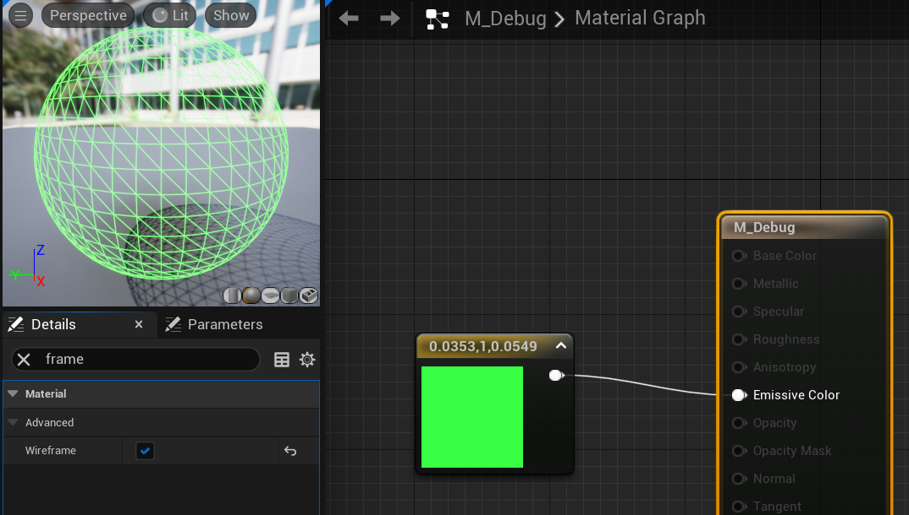

##### 2.4.在蓝图中控制

将P，S公开，可以实时调整大小

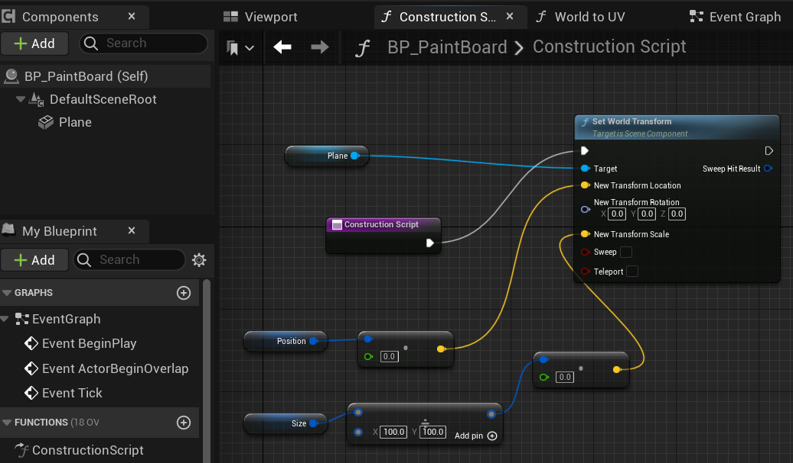

##### 2.5.QA

A .怎么随心创建固定大小位置的雪地？

在材质函数摄入MPC全局参数中设置UV，使得世界坐标原点映射到UV（0，0）；同时将人的坐标在BP中也同样转换，BP承担另一个作用设置MPC；

B.改变雪地size脚印会变形？目前RT还是固定大小，没有根据size变化而改变。
