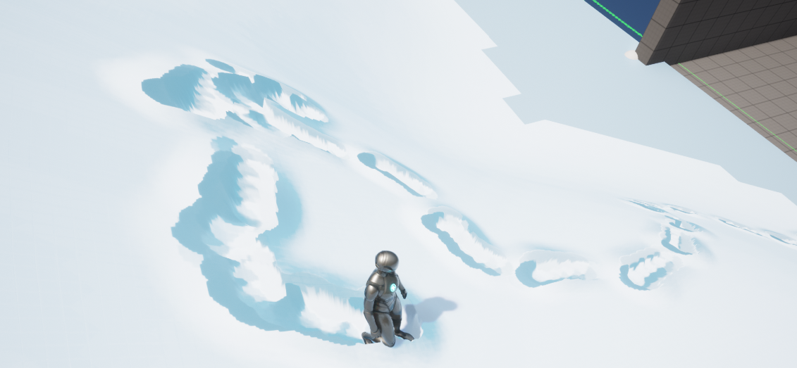

### Easy interactive snow

The goal of this project is to generate a scene component that can be added to any object to produce the trajectory effect achieved when interacting with snow. Thanks to LingFeng for sharing wonderfully in UOD2022, this project builds on this.

UE version supports: **5.0, 5.1**.

For more details, see **Step.md** in the root directory.

**TODO**: More realistic snow achieved with Niagara.