## 交互雪制作

### 1.画板制作

##### 1.1.本节效果

##### 1.2.大蓝图BP_Paintboard

在每帧获取人物位置转换到这一个 rt 的 uv 上，使用蓝图在这个位置绘制一个texture。新建一张RT（1024*1024的RT，RGBA16F）上绘制Texture，与人物中心重合，注意角度。

##### 1.3.材质M_Snow

将RT覆盖在2000*2000地板上，通过UVlerp和boxmask

##### 1.4.QA

###### A. 纹理不在人物正中心？

需要减去Size的一半。

###### B.为什么要后面绘制的东西不见了？

多个脚印重叠问题：换成半透明图片，BlendMode选半透明。

###### C.画板到后期我们肯定是雪是要越踩越低的？

所以我们到后面还得获取到雪原本它的一个高度，肯定不能有简单的透明。我们肯定还要拿材质，就用 mean 取最小值的方法。

### 2.映射位置

##### 2.1.本节效果

##### 2.2.材质函数MF_World2SnowUV

将大蓝图中地形的Position和size，传入Materials；有两种方法，一个是**动态材质实例**（在蓝图里 create dynamic material instance，需要拿到地面引用，把动态材质实例给地面 set material，个体控制），另外一个方法就是使用**材质参数集**（material parameter collection，全局控制）。

A.首先设置MPC_Snow矩阵，用来存Position和Size

B.新建材质函数并应用在M_Snow中

C.蓝图中添加全局变量材质参数

##### 2.3.BP_Paintboard：Set MPC和更新World2UV

现在就可以不受上一节2000*2000的限制，直接在蓝图变量下设置位置大小，记得映射转换成UV

##### 2.3.M_Debug

shaderMode选Unlit；Frame选线框

##### 2.4.在蓝图中控制

将P，S公开，可以实时调整大小

##### 2.5.QA

###### A .怎么随心创建固定大小位置的雪地？

在材质函数摄入MPC全局参数中设置UV，使得世界坐标原点映射到UV（0，0）；同时将人的坐标在BP中也同样转换，BP承担另一个作用设置MPC；

###### B.改变雪地size脚印会变形？

目前RT还是固定大小，没有根据size变化而改变。

### 3.雪地跟随

##### 3.1.本节效果

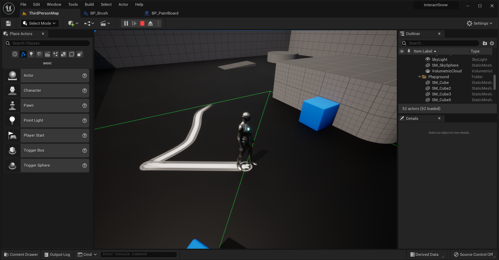

##### 3.2.位置更新：函数UpdatePos

需要更新的有1.变量position；2.Debug框位置；3.MFC位置；对三部分复制set

每次更新位置的时候，把当前 position 设置为 last position，在我们把我们新更新出来的位置给它 set 出来。

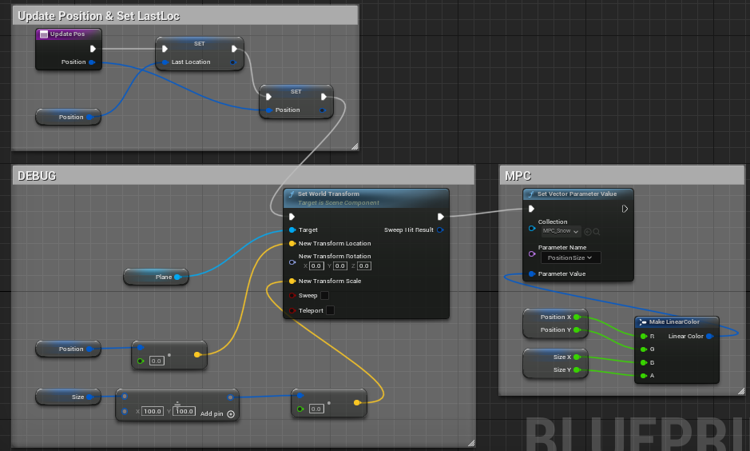

##### 3.3.平移材质M_Translation

务必确保texture为RT_SnowSave！！！否则会出现无纹理；

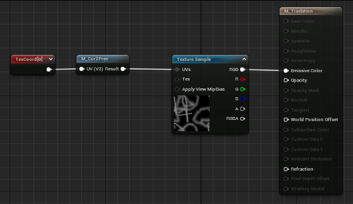

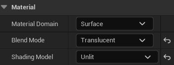

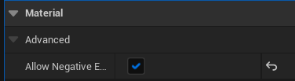

##### 3.4.平移量计算函数MF_Cur2Prev

只取两个通道，黄色框为常量转Para,请保证名字一致Offset，后面才能Set Vector Para value；

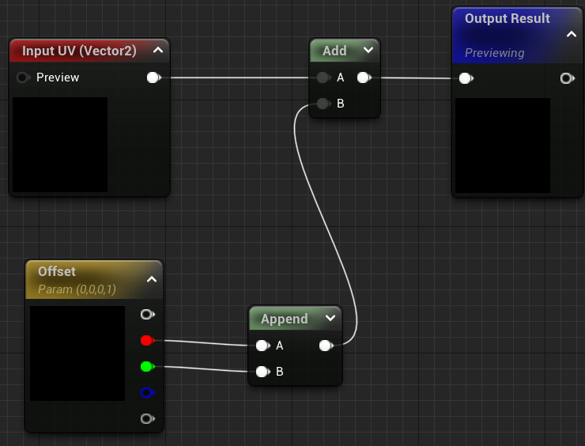

##### 3.5.拷贝RT：

RT往RTsave上以size整个绘制过去，即复制。

由于RT的写入无法写入透明a通道：所以在复制时混合模式需要切换为Oqaque（不透明）

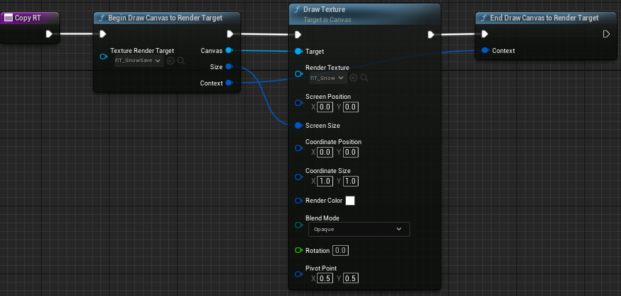

##### 3.6.拷贝式主蓝图

后半部分不变仍然是Draw Canvas。注意不要将m_Translation绘制，而是绘制动态材质实例。

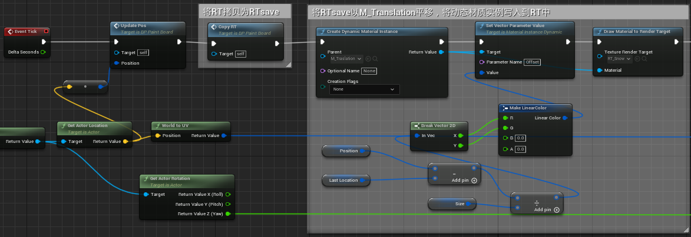

##### 3.7.QA

###### A.用材质来绘制 render target有什么注意的？ 

使用材质绘制 render target 的时候，其实可以只有不透明度通道和 emissive colour这两个通道是有效的。

###### B.为什么不能直接把 a 平移后绘制在 a 上。而要先把 a 放到其他上面，然后再把它绘制回来？

无法再绘制一张 r t 的同时对它进行采样

###### C.在3.5方法下出现两个问题：1）越到后面图片越模糊：重叠+像素未对齐2）边缘消失的另一边又出现

1）在拷贝完清除像素，UpdatePos取整补齐像素；

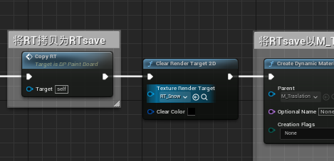

下面这个注意是乘以像素,否size太大无法移动

2）边缘消融，通过控制透明度。

<<<<<<< HEAD
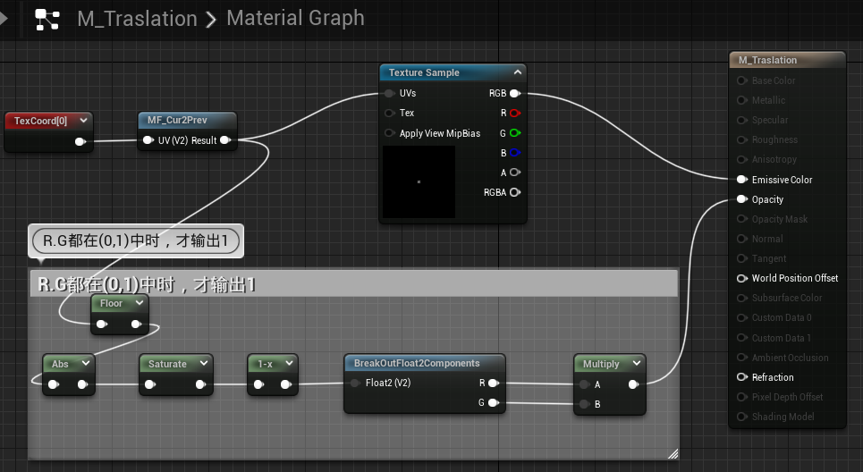
=======

### 4.雪地画笔

##### 4.1.本节效果

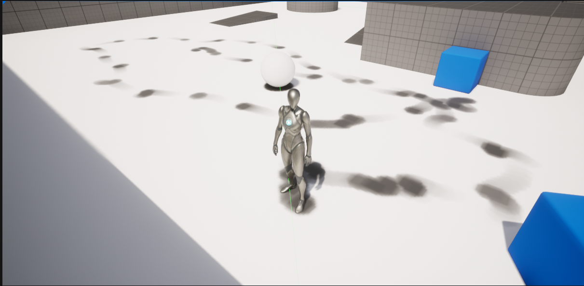

##### 4.2.让 brush 和画板通讯

1）没有直接获取拥有组件的actor，只有按类获取 actor 或者按 tag 获取 actor。或者当你获取到了一些 actor 之后，先获取到人物的character，再拿到人物的actor，再按类获取，获取它上面的组件。我们既然希望这个组件附加在任何地方，或许显然可能有点不太方便。

2）因此使用数组Array：Custom event brush+structure一收一发

A.此步BP_Brush：

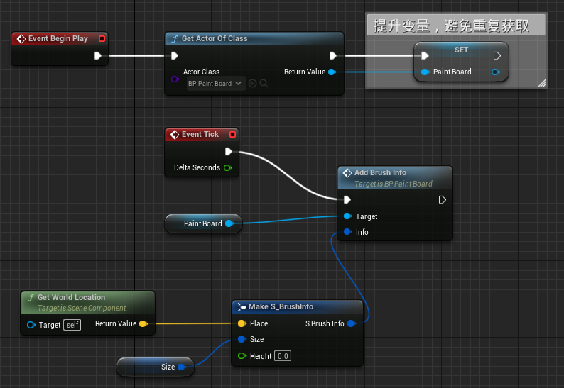

B.将画板蓝图中的Draw Material后操作坍塌成Draw：

拿到Info数组中的position和Size进行loop绘制，注意PixelSize需要Set=size/分辨率

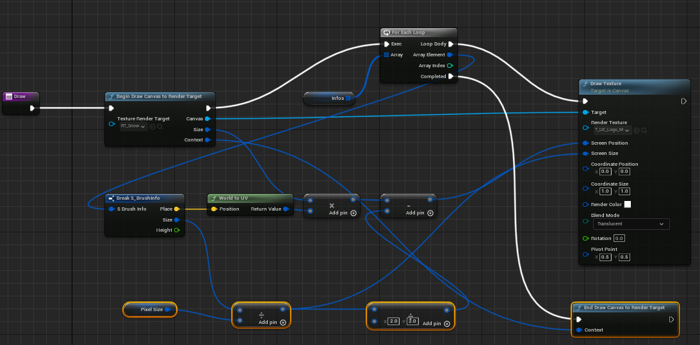

C .在BP_Brush中Tick和画板中设置Info信息

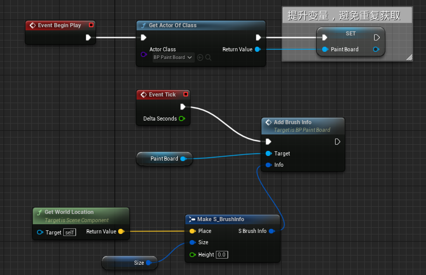

画板赋值

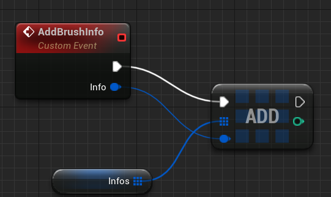

D .将BP_Brush附加到Char中**Mesh**中的左右脚，在Socket中切换成foot; 默认不是脚底，记得微调。

目前效果：

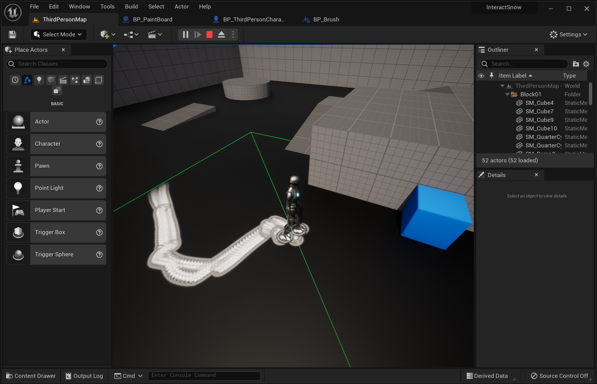

##### 4.3.考量脚高度

射线检测：1.没hit说明，脚比雪地高，不绘制；2.深浅效果：雪地高度-距离/雪地高度->（0,1）,直接影响rendercolor

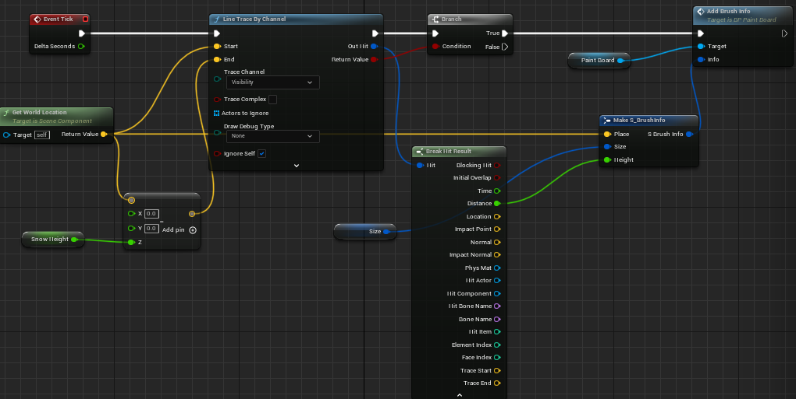

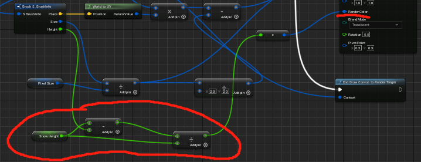

##### 4.4.雪是越踩越深的，不能直接按顺序遮挡

需要根据以前脚印和现在求最小值

A.在Draw Canvas to RT上多循环绘制一个材质M_Draw,其中Height通过draw中的动态材质实例传递

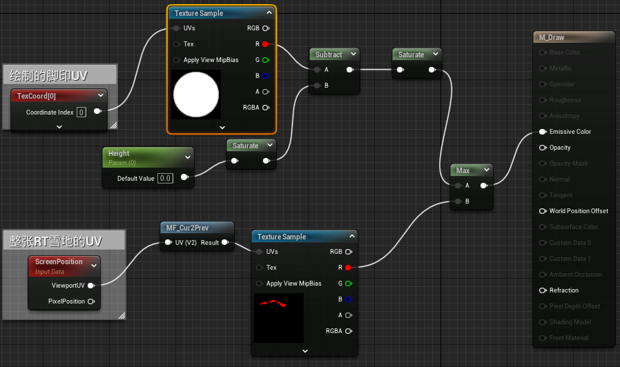

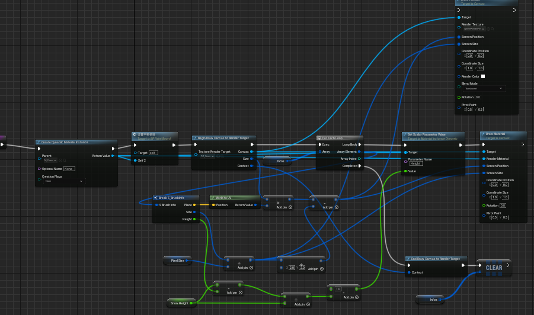

##### 4.5.QA

###### A.actor component和scene component的区别？

actor component 其实是直接附加在 actor 上的。 scene component是 actor component 的一种，它其实是继承自 actor component，它的区别在于它是有一个transform的

###### B.如何保证 brush 始终是在 take 之前完成的?

class setting->tick->模拟物理之后

###### C.运行时帧数一直下降?

每帧创建的Info没有清空,记得clear